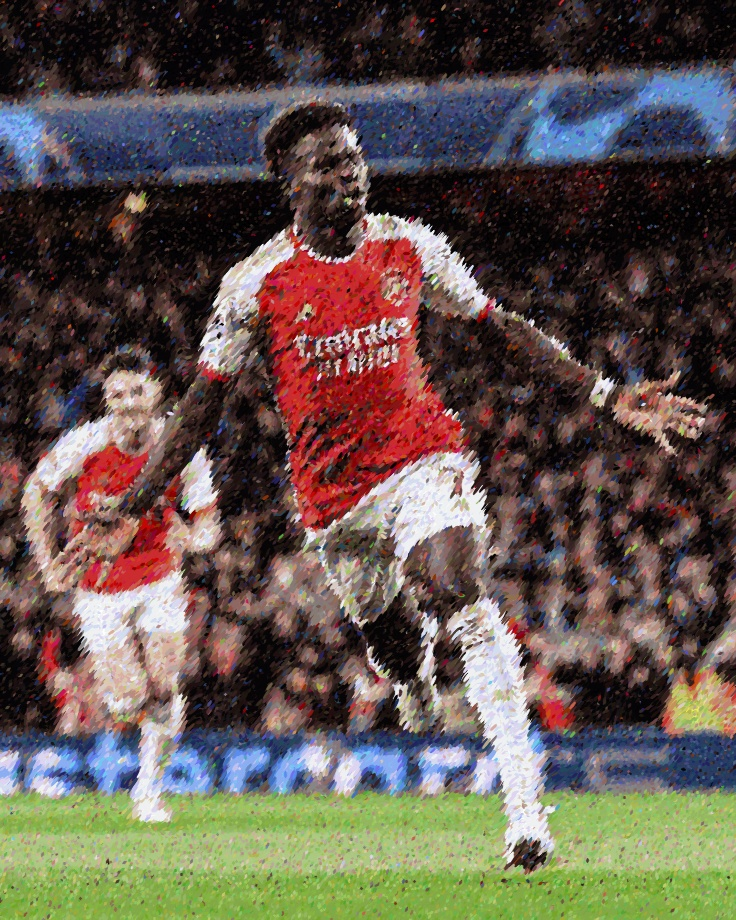

# Pointillism


Pointillism is a painting technique where small distinct dots of pure color are applied on the surface. The viewers' eyes and mind blend them to form a complete image. An aim for me to try out visual computing.

## Installation
```
git clone git@github.com:allenshamrock/pointillism.git
cd Pointillism
pip freeze > requirements.txt

```